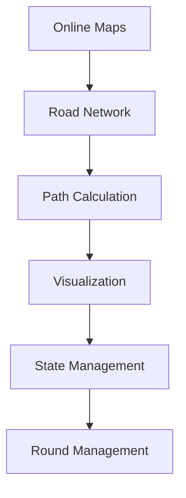

# System Integration Technical Specification

## Global Cache Hierarchy

### Tier 1: Active Memory Cache (RAM)
- Maximum Allocation: 256MB total
  - Online Maps: 128MB
  - Path Calculation: 64MB
  - Road Network: 32MB
  - Visualization: 32MB
- Garbage Collection Threshold: 75% usage
- Priority: Immediate access

### Tier 2: Local Storage Cache
- Maximum Allocation: 1GB total
  - Map Tiles: 512MB
  - Path Results: 256MB
  - Road Data: 256MB
- Invalidation: LRU (Least Recently Used)
- Compression: Enabled for all stored data

### Tier 3: Background Processing Queue
- Maximum Queue Size: 100 items
- Priority Levels: Immediate, High, Normal, Low
- Memory Budget: 32MB working memory
- Battery Impact: < 5% per hour

### Cache Coordination
- Centralized Cache Manager
- Cross-System Memory Monitoring
- Shared Resource Allocation
- Unified Cleanup Protocol

## Performance Standards

### Memory Thresholds
- Mobile Devices
  - Low End: 256MB total
  - Mid Range: 512MB total
  - High End: 1GB total

### Loading Times
- Initial Load: < 3 seconds
- State Transitions: < 1 second
- Background Operations: < 100ms impact

### Frame Rates
- Target: 60 FPS
- Minimum: 30 FPS
- Loading: > 24 FPS

## Error Handling Protocol

### Severity Levels
1. Critical - System Crash Risk
2. Major - Feature Blocking
3. Minor - Performance Impact
4. Info - Logging Only

### Recovery Actions
1. Memory Pressure
   - Clear non-essential caches
   - Reduce quality settings
   - Force garbage collection
   
2. Network Failure
   - Use cached data
   - Reduce update frequency
   - Queue reconnection attempts

3. Performance Issues
   - Reduce visual quality
   - Limit background processes
   - Decrease cache sizes

## Integration Points

### System Dependencies

### Cross-System Events
- MemoryWarning
- NetworkStateChange
- PerformanceDrop
- StateTransition
- RoundComplete

## Implementation Phases

### Phase 1: Foundation (Week 1-2)
- Basic system integration
- Memory management
- Error handling
- Event system

### Phase 2: Enhancement (Week 3-4)
- Advanced caching
- Performance optimization
- Cross-system coordination
- Testing framework

### Phase 3: Polish (Week 5-6)
- Edge case handling
- Performance tuning
- Documentation
- Final testing

## Memory Management Framework

### Memory Profiling Requirements
- Active memory tracking
- Memory growth monitoring
- Leak detection systems
- GC impact analysis
- Cache efficiency metrics
- Device-specific profiling

### Resource Allocation Strategy
- Dynamic allocation based on device capability
- Adaptive cache sizing
- Proactive cleanup triggers
- Performance-based scaling
- Device tier detection

### Memory Thresholds
To be determined through testing:
- Baseline memory requirements
- Growth patterns during gameplay
- Algorithm memory impact
- Cache size optimization
- Device-specific limits
- Performance vs memory tradeoffs

### Memory Optimization Priorities
1. Gameplay Smoothness
   - Maintain target FPS
   - Minimize GC spikes
   - Optimize asset loading
   - Manage state transitions

2. Resource Efficiency
   - Smart cache management
   - Asset pooling strategies
   - Background load balancing
   - Memory defragmentation

3. Device Compatibility
   - Low-end device support
   - High-end optimization
   - Platform-specific tuning
   - Scalable quality settings

